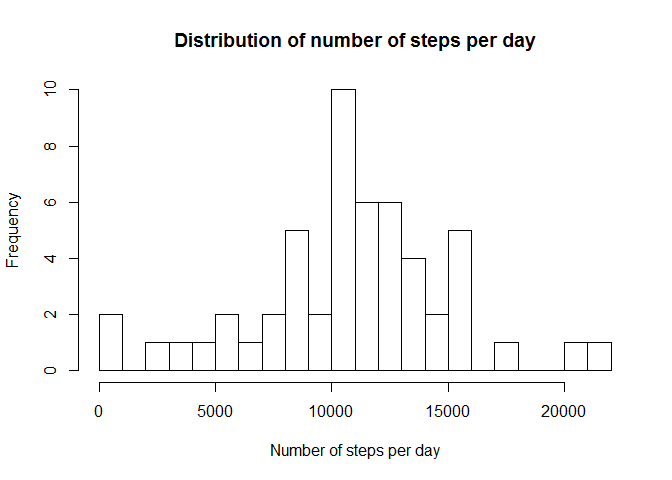
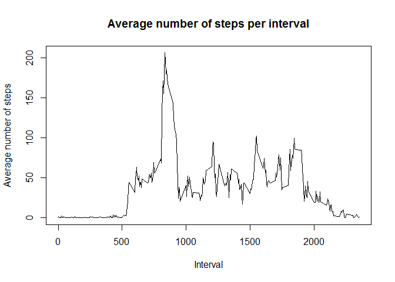
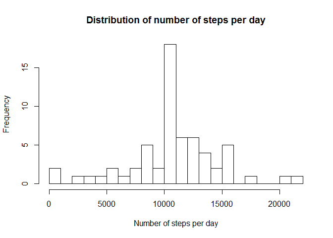
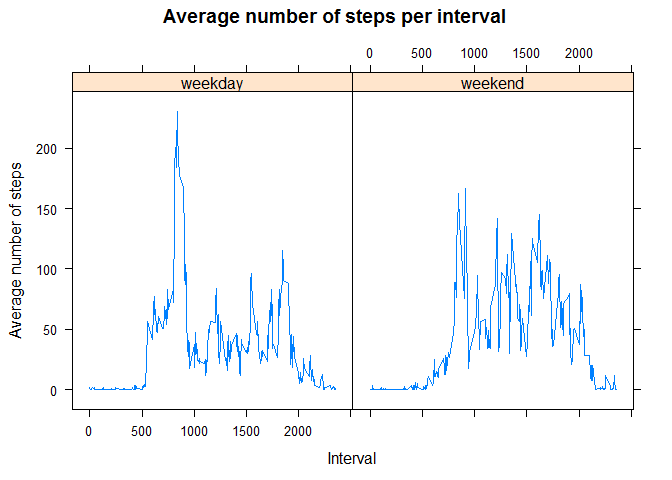

# Reproducible Research: Peer Assessment 1


## Loading and preprocessing the data


```r
library(data.table)
```

```
## Warning: package 'data.table' was built under R version 3.1.2
```

```r
library(lattice)
```

```
## Warning: package 'lattice' was built under R version 3.1.2
```

```r
D=read.csv(unzip('activity.zip'))
DT=data.table(D)
```

## What is mean total number of steps taken per day?

Histogram of the total number of steps taken each day

```r
hist(DT[,sum(steps),by=date]$V1,breaks=21,main="Distribution of number of steps per day",xlab="Number of steps per day")
```

 

Mean and median total number of steps taken per day:

```r
mean(DT[,sum(steps),by=date]$V1,na.rm=TRUE)
```

```
## [1] 10766.19
```

```r
median(DT[,sum(steps),by=date]$V1,na.rm=TRUE)
```

```
## [1] 10765
```

## What is the average daily activity pattern?

Average number of steps taken, averaged across all days, by intervals

```r
with(DT[!is.na(steps),mean(steps),by=interval],plot(V1~interval,type='l',xlab="Interval", ylab="Average number of steps",main="Average number of steps per interval"))
```

 

This interval contains the maximum number of steps

```r
with(DT[!is.na(steps),mean(steps),by=interval],interval[which.max(V1)])
```

```
## [1] 835
```

## Imputing missing values

Total number of missing values in the dataset

```r
DT[is.na(steps),.N,]
```

```
## [1] 2304
```

New dataset where missing values are replaced with average number of steps in the same interval

```r
DT2=DT
DT2[,newsteps:=mean(steps,na.rm=TRUE),by=interval]
DT2[,steps:=as.double(steps)]
DT2[is.na(steps),steps:=newsteps]
```

Histogram of the total number of steps taken each day

```r
hist(DT2[,sum(steps),by=date]$V1,breaks=21,main="Distribution of number of steps per day",xlab="Number of steps per day")
```

 

Mean and median total number of steps taken per day:

```r
mean(DT2[,sum(steps),by=date]$V1,na.rm=TRUE)
```

```
## [1] 10766.19
```

```r
median(DT2[,sum(steps),by=date]$V1,na.rm=TRUE)
```

```
## [1] 10766.19
```

Sample characteristics (except median) stays the same because we replaced missed values with averages 

## Are there differences in activity patterns between weekdays and weekends?

New factor variable datetype

```r
DT2[((as.numeric(date)-1) %% 7)<5,datetype:='weekday',]
DT2[((as.numeric(date)-1) %% 7)>=5,datetype:='weekend',]
DT2[,datetype:=as.factor(datetype),]
```

Panel plot containing two plots with average number of steps averaged across all weekday days and all weekend days

```r
DT3=DT2[,mean(steps),by=list(interval,datetype)]
xyplot(V1~interval|datetype,DT3,xlab="Interval", ylab="Average number of steps",main="Average number of steps per interval",panel=llines)
```

 
